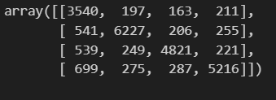
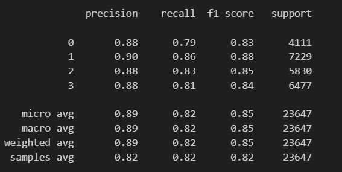

# Twitter Sentiment Analysis with LSTM

This project demonstrates a deep learning approach to sentiment analysis using a Twitter dataset. The workflow includes preprocessing text data, encoding labels, and building a Long Short-Term Memory (LSTM) network to classify sentiments.

## Dataset
The dataset used is a Twitter sentiment dataset (`twitter_training.csv`) with the following columns:
- `ID`: Unique identifier for each tweet.
- `Category`: Category of the tweet.
- `Sentiment`: Sentiment label (e.g., Positive, Negative, Neutral, etc.).
- `Text`: Text content of the tweet.

## Steps

### 1. Data Preprocessing
- Load the dataset using `pandas`.
- Check for and handle null values.
- Rename columns for better clarity.
- Drop rows with missing values in the `Text` column.

### 2. Text Cleaning and Tokenization
- Remove non-alphabetic characters using regular expressions.
- Convert text to lowercase.
- Tokenize text and remove stopwords using the NLTK library.
- Apply stemming using the Porter Stemmer.
- Create a corpus of preprocessed text.

### 3. Text Vectorization
- Encode words using the `one_hot` method with a vocabulary size of 10,000.
- Pad sequences to ensure uniform input length.

### 4. Model Building
- Build an LSTM-based model using TensorFlow/Keras.
- Architecture includes:
  - Embedding layer with an embedding dimension of 300.
  - LSTM layer with 100 units.
  - Dense output layer with a softmax activation function.
- Compile the model using the Adam optimizer and categorical cross-entropy loss.

### 5. Label Encoding and Splitting Data
- Encode the `Sentiment` column using `LabelEncoder`.
- Convert labels to one-hot encoding.
- Split the dataset into training and testing sets with a 67-33 split ratio.

### 6. Model Training
- Train the model for 10 epochs with a batch size of 64.
- Use validation data to monitor performance.

### 7. Model Evaluation
- Predict sentiments for the test set.
- Evaluate the model using:
  - Accuracy score.
  - Confusion matrix.
  - Classification report.

## Results
- The model achieved an accuracy of **0.8246** on the test set.
- Below are some classification result visualizations:

### Confusion Matrix:

### Classification Report:

  

## Contributing
Feel free to raise issues or create pull requests for improvements or bug fixes.

## License
This project is licensed under the 3-Clause BSD License. See the [LICENSE](./LICENSE) file for details.
